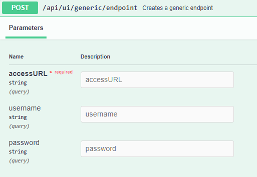
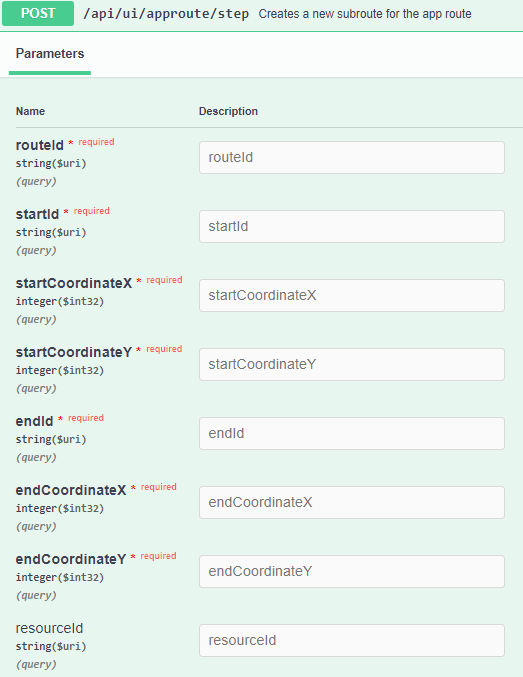
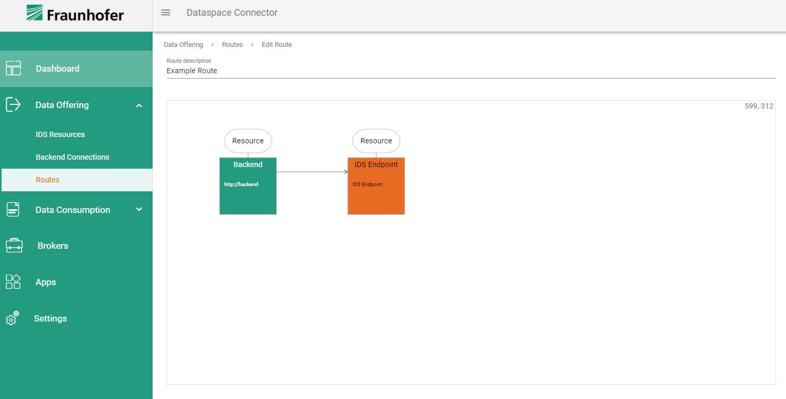

<p align="center">

</p>

<br>

<p align="center">
<a href="https://github.com/International-Data-Spaces-Association/IDS-ConfigurationManager/blob/development/LICENSE"></a>
<a href="https://github.com/International-Data-Spaces-Association/IDS-ConfigurationManager/issues"></a>


</p>

# IDS - Configuration Manager

The configuration manager is the administrative part of a connector. It main task is to manage and validate the
configuration model, followed by the deployment of the connector. The configuration model is an extensible domain model
which describes the configuration of a connector. It consists of technology-independent, interconnected configuration
aspects.

In the current version the development of configuration manager is linked to the open source projects
[Dataspace Connector](https://github.com/International-Data-Spaces-Association/DataspaceConnector) and
[Configuration Manager UI](https://github.com/International-Data-Spaces-Association/IDS-ConfigurationManager-UI).

This repository has a develop branch in addition to the master branch. The idea is to always merge other branches into
the develop branch (as SNAPSHOT version) and to push the changes from there into the master only for releases. This way,
the develop branch is always up to date, with the risk of small issues, while the master only contains official
releases.

## Table of Contents

<!-- TOC -->

- [Architecture](#architecture)
- [Features](#features)
    - [Technologies](#technologies)
    - [IDS Components](#ids-components)
- [Getting Started](#getting-started)
    - [Installing](#installing)
- [Backend API](#backend-api)
- [Hands-on IDS Configurationmanager](#hands-on-ids-configurationmanager)
- [Versioning](#versioning)
- [Authors](#authors)
- [License](#license)

<!-- TOC -->

---
<a name="architecture"></a>

## Architecture

The following illustration visualizes the interaction of Dataspace Connector, IDS Framework, Configuration Manager, and
GUI. All components have a defined API that allows individual components to be removed or replaced. The connector can be
deployed standalone and can be connected to existing backend systems. Configuration Manager and GUI facilitate the
operation and configuration of the connector. If desired, the Dataspace Connector may be replaced by another connector
implementation, either integrating the framework or not.


To get more information about the Dataspace Connector or the UI for the Configuration Manager, follow these links:

* [Dataspace Connector](https://github.com/International-Data-Spaces-Association/DataspaceConnector)
* [Configuration Manager UI](https://github.com/International-Data-Spaces-Association/IDS-ConfigurationManager-UI)

---
<a name="features"></a>

## Features

This is a list of currently implemented features, which is continuously updated.

* The configuration can be fetched and updated from a connector
* Proxy settings for the configuration can be made
* Generic endpoints and connector endpoints can be created and edited for creating app routes
* The available brokers can be retrieved, which are located in an internal H2 database
    * Connectors can be registered with a broker, removed or updated
* An external connector can be accessed to fetch their offered resources
* The configuration of the resources can be done in the configuration manager and is transferred to the Dataspace
  Connector
    * The configuration of resources also includes the management of their representations, which are transferred to the
      Dataspace connector.
    * The configuration of resources also includes the management of their contracts, which are transferred to the
      Dataspace connector
* The Dataspace Connector is notified about every change in the configuration model, e.g. when changes are made to
  resources, the connector or the configuration model itself
* App routes can be defined for offering data or resources (under construction)
* Dummy data apps can be loaded to simulate data processing workflows

<a name="technologies"></a>

### Technologies

`Java`, `Maven`, `Spring Boot`, `Rest`, `OpenAPI`, `Swagger`, `SLF4J`, `JSON(-LD)`, `H2`, `Project Lombok`, `JUnit`
, `JWT`, `OkHttp`

<a name="IDS Components"></a>

### IDS Components

| Library/Component | Version | License | Owner | Contact |
| ------ | ------ | ------ | ------ | ------ |
| IDS Information Model Library | 4.0.2 | Apache 2.0 | Fraunhofer IAIS | [Sebastian Bader](mailto:sebastian.bader@iais.fraunhofer.de) |
| IDS Information Model Serializer Library | 4.0.2 | Apache 2.0 | Fraunhofer IAIS | [Sebastian Bader](mailto:sebastian.bader@iais.fraunhofer.de) |
| [Dataspace Connector](https://github.com/International-Data-Spaces-Association/DataspaceConnector) | Recommended: 4.1.0 - 4.3.0 | Apache 2.0 | Fraunhofer ISST | [Julia Pampus](mailto:julia.pampus@isst.fraunhofer.de) |
| [Configuration Manager UI](https://github.com/International-Data-Spaces-Association/IDS-ConfigurationManager-UI) | latest | Apache 2.0 | Fraunhofer FKIE | [Bastian Weltjen](mailto:bastian.weltjen@fkie.fraunhofer.de) |

---
<a name="getting-started"></a>

## Getting Started

You need:

* Maven
* REST client for testing, like ARC

<a name="installing"></a>

### Installing

Clone the project from

```
https://github.com/International-Data-Spaces-Association/IDS-ConfigurationManager
```

open the directory and run

```
mvn clean package
```

When building was successfully, go into target folder and run with current version number (<X.Y.Z>):

```
java -jar configmanager-<X.Y.Z>.jar
```

in terminal to start the configuration manager.

---
<a name="backend-api"></a>

## Backend API

In the following, the different APIs are described and explained. Most apis are mainly used by the user interface to
simplify configuration of a connector.

* `App Route Management: ` The app route apis help to define app routes and subroutes. When creating subroutes,
  resources can also be published. Furthermore, the app route deploy method can be customized, which are then valid for
  all routes in the configuration model.
* `Connector Request Management: ` The connector request apis help to request offered resources from external
  connectors.
* `Connector Management: ` The connector apis help to manage the connector description in the configuration model. It is
  also possible to check if a connector is reachable.
* `Resource Management: ` The resource apis help to manage the resources. All configurations on the resources are
  transferred to the Dataspace connector and persisted there.
* `Resource representation Management: ` A resource can have different representations. The representations apis helps
  to manage the different representations of a resource.
* `Resource contracts Management: ` The resource contracts apis help to retrieve or update the contracts of a resource.
* `Configmodel Management: ` The configuration model apis help to query or update the configuration.
* `Broker Management: ` The broker apis help to manage individual brokers. It offers several endpoints to manage the
  brokers. This includes, for example, registering a connector or resource with a broker.
* `Endpoints Management: ` The endpoints apis help to manage endpoints like GenericEndpoint oder ConnectorEndpoint.
* `Util Management: ` The utility apis help to make or query other configurations.
* `Database: ` The internal database persists all the necessary data that is not transferred to the Dataspace Connector,
  such as the storage of endpoint information like the coordinates. Console path of the
  database: `http://localhost:8081/console`

---
<a name="hands-on-ids-configurationmanager"></a>

## Hands-on IDS Configurationmanager

To interact with the running application, the provided endpoints at the Swagger UI can be used. The Swagger UI is
available at: `http://localhost:8081/swagger-ui/index.html?url=/v3/api-docs/` .

The following is an example of how an app route can be defined in configuration manager to provide resources. The
following points are discussed:

* Creating a resource
* Creating a generic endpoint and a connector endpoint
* Creating a resource representation
* Creating an app route and a subroute

`Step 1) Creating a resource`

To create an offered resource, the API: POST - `/api/ui/resource` can be used.


After the necessary fields have been filled in, the request can be sent, and the following response should be provided.

```
{
  "resourceID": "https://w3id.org/idsa/autogen/resource/fc1613eb-f36e-4889-bdb3-a31e66e341a3",
  "connectorResponse": "fc1613eb-f36e-4889-bdb3-a31e66e341a3"
}
```

It displays the id of the created resource and the response from the Dataspace Connector.

`Step 2) Creating a generic endpoint and a connector endpoint`

Next, a generic endpoint is defined, which will be the start of the route from which the resource will be published. The
following API can be used for this purpose: POST - `/api/ui/generic/endpoint`.



Here the access url of the endpoint can be defined and optionally an authentication can be added. After successfully
creating an endpoint, the following response should be delivered:

```
{
  "id": "https://w3id.org/idsa/autogen/genericEndpoint/c01d4e34-2517-458b-bdef-61a5ba5b94b7",
  "message": "Created a new generic endpoint"
}
```

In the same way, create a Connector Endpoint through which the resource will be published. The following API can be used
for this purpose: POST - `/api/ui/connector/endpoint`.

`Step 3) Creating a resource reprsentation`

Like the other steps you can use the API POST `/api/ui/resource/representation` to create a resource representation.
Here you can use the id of the resource and the created endpoint.

If no errors occurred while creating a representation, the following response should be returned:

```
{
  "resourceID": "https://w3id.org/idsa/autogen/resource/fc1613eb-f36e-4889-bdb3-a31e66e341a3",
  "connectorResponse": "946529d8-7109-4a04-b57b-32f28b68b871",
  "representationID": "https://w3id.org/idsa/autogen/representation/946529d8-7109-4a04-b57b-32f28b68b871"
}
```

Here you can see the id of the resource and the representation. Also, the response of the Dataspace Connector.

`Step 4) Creating an app route and a subroute`

Now an app route can be defined via the API: POST `/api/ui/approute`. To complete the route definition, the subroute
must be defined at the end. This is done via the API: POST `/api/ui/approute/step`.



All necessary fields must be filled in here. That means, the id of the created app route must be set, the generic
endpoint id is necessary as startId, the x and y coordinates of the first endpoint must be specified, the id of the
connector endpoint must be set as well as the corresponding x and y coordinates. In addition, to publish the resource,
the id of the resource can be passed here.

When successful, the following response should be provided:

```
{
  "routeStepId": "https://w3id.org/idsa/autogen/routeStep/34870533-acc5-4fbf-8c29-136ea275bd2e",
  "message": "Successfully created the route step"
}
```

The result of the work can be optionally viewed in the configuration manager user interface. There, the created route is
visualized under the Data Offering tab under Routes.



---

<a name="versioning"></a>

## Versioning

Please read the `CHANGELOG.md` for versioning details.

---

<a name="license"></a>

## License

This project is licensed under the Apache License 2.0 - see the LICENSE.md file for details.
